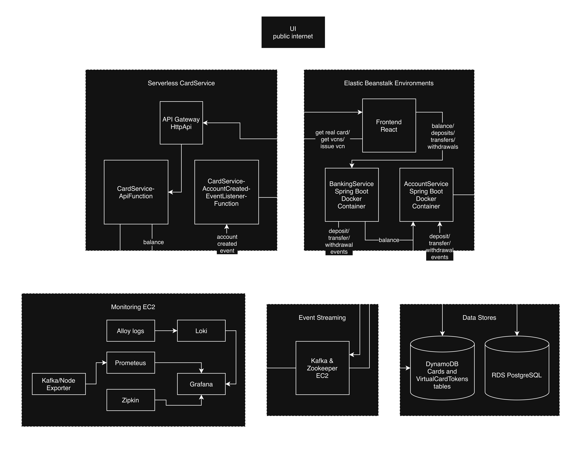

## Banking Portfolio Application

A full-stack, event-driven banking system built on AWS, demonstrating modern cloud-native architecture with serverless components, secure VPC design, and comprehensive observability.

### Architecture



### Overview

- **Frontend**: React single-page app on Elastic Beanstalk (Docker)
- **Banking & Account Services**: Spring Boot Java applications on EB Docker platform
- **Card Service**: Serverless AWS Lambda with Spring Cloud Function, HttpApi, and DynamoDB
- **Event Bus**: Private Kafka cluster on EC2
- **Observability**: Prometheus, Grafana, Loki, Alloy, Zipkin
- **Unit and Integration Testing**: JUnit, Mockito, Testcontainers, Vitest, MSW
- **Code Quality & Security**: SonarQube, OWasp

**Key Highlights**:
- Event-driven card creation via Kafka
- Load tested with k6 at 5000 virtual users (0% errors, p95 ~69 ms)
- Secure VPC with private endpoints
- Full observability across metrics, logs, and traces

### Tech Stack

- Frontend: React, Redux, Tailwind
- Backend: Spring Boot 3, Spring Cloud AWS, Spring Cloud Function
- Infrastructure: AWS Elastic Beanstalk (Docker), AWS Lambda, API Gateway HTTP API, DynamoDB, RDS PostgreSQL, Kafka on EC2
- CI/CD: GitHub Actions + AWS SAM + CloudFormation
- Observability: Prometheus, Grafana, Loki, Alloy, Zipkin, k6

## System Maturity & Engineering Roadmap (Work in Progress)
This architecture is being rolled out in two planned engineering phases to simulate real-world production software lifecycles: from an initial high-throughput MVP to a hardened, enterprise-grade financial ledger.

> **Phase 1: Core Functional MVP** — `100% COMPLETE`
> * Fully operational distributed ledger boundaries, asynchronous card generation via Kafka streams, and AWS Lambda SnapStart deployments. 
> * *Status:* Stable and verified via integration test suites.

> **Phase 2: Day-2 Production Hardening** — `IN PROGRESS`
> * Actively integrating database-level transaction isolation guardrails to insulate the ledger from high-concurrency race conditions.
> * *Current Focus:* Implementing JPA Pessimistic Row Locking and the Transactional Outbox Pattern.

### Structural Tracking Ledger

| Engineering Track | Target Milestone / Design Pattern | Status | Objective / Problem Solved |
| :--- | :--- | :--- | :--- |
| **Messaging** | Asynchronous Decoupled Card Generation | **✅ Production-Ready** | Decouples heavy account workflows via Kafka streams. |
| **Security** | Automated Vulnerability Gates | **✅ Production-Ready** | Running inline OWASP ZAP and SonarQube CI/CD checks. |
| **Observability** | Full Telemetry Context Ingestion | **✅ Production-Ready** | Capturing traces/logs via Grafana Alloy, Loki, & Prometheus. |
| **Concurrency** | **JPA Pessimistic Row Locking (`FOR UPDATE`)** | *🛠️ In Development* | Mitigating high-frequency balance overwrite races. |
| **Consistency** | **Transactional Outbox Database Pattern** | *🛠️ In Development* | Eliminating the microservice dual-write split-brain risk. <sup>[1](#note1)</sup> |
| **Infrastructure** | **Safe Rolling Deployments** | *🛠️ In Development* | Transitioning CI/CD away from destructive stack teardowns. |

<p id="note1" style="font-size: 0.85em;"><sup>1</sup> See <a href="#2-runtime-coupling--latency-mitigation">Architectural Trade-offs: Runtime Coupling & Latency Mitigation</a> below for details on current cross-service HTTP dependencies and Phase 2 mitigation.</p>

### Current Focus: Distributed Resilience Hardening
The core business domain logic and asynchronous pipelines are fully operational. The platform is currently undergoing active **Phase 2 Hardening** to integrate database-level transaction isolation rules and transactional outbox capturing. This phase will guarantee ledger data integrity under edge cases like infrastructure drops or intense network partition splits.

### Setup Instructions

#### Prerequisites (Local Machine Installation)

Before running locally or deploying, install the following tools:

- **AWS CLI v2** – `aws configure` after installation
- **AWS SAM CLI** – Required for card-service local development and deployment
- **Docker & Docker Compose** – For running banking, account, and monitoring services
- **LocalStack** – For local DynamoDB emulation (`pip install localstack` or via Docker)
- **Maven** – For building Spring Boot services
- **Node.js + npm** – For frontend (React)
- **k6** – For load testing (`brew install k6` on macOS, or official installer)
- **Git** – Obviously

**Optional but recommended**:
- **Insomnia / curl** – For manual API testing

All tools are free and work on macOS, Linux, and Windows (WSL recommended for Windows).

#### AWS Deployment

The full AWS deployment is handled by **GitHub Actions** (`.github/workflows/ci-cd.yml`).

**Required GitHub Secrets** (add in repository Settings → Secrets and variables → Actions):

| Secret Name | Description |
|-------------|-------------|
| `AWS_ACCESS_KEY_ID` | AWS IAM user access key  |
| `AWS_SECRET_ACCESS_KEY` | AWS IAM user secret key  |
| `DOCKERHUB_USERNAME` | Docker Hub username  |
| `DOCKERHUB_TOKEN` | Docker Hub access token  |
| `YOUR_PUBLIC_IP`  | Your public IP (for temporary SSH to Kafka EC2) |

**Deployment Steps**:

1. Push code to the `main` branch (or the branch configured in `ci-cd.yml`).
2. GitHub Actions will automatically:
   - Build and test Docker images for banking-service, account-service, and frontend
   - Deploy the four CloudFormation stacks (`core`, `eb`, `card-lambda`, `monitoring`)
   - Run smoke tests

**After deployment**, you will see outputs in the GitHub Actions logs for:
- Frontend URL
- Card Service API URL
- Monitoring EC2 public IP (Grafana, Zipkin, etc.)

#### Local Development

##### 1. Start core banking services and monitoring stack

**Important note**: Start core banking services first to create the `banking-network` for monitoring stack.  
You can start core alone if you don't need monitoring.

```shell
# Option 1: Core only
docker-compose up -d  # root directory

# Option 2: Core + Monitoring (recommended for full observability)
docker-compose up -d
cd monitoring
docker-compose -f docker-compose.monitoring.yml up -d
```

This starts:
- frontend (port 80)
- banking-service (port 8080)
- account-service (port 8081)

Access:
- React UI: http://localhost
- Grafana: http://localhost:3000 (admin/admin)
- Zipkin: http://localhost:9411
- Prometheus: http://localhost:9090
- Loki: http://localhost:3100

##### 2. Start Card Service Locally (with LocalStack)

```shell
cd backend/card-service

# Start LocalStack for DynamoDB
localstack start -d

# Start SAM local API (uses LocalStack)
sam local start-api --debug
```

Card service will be available at http://localhost:3000 (or the port shown in SAM output).

##### 3. Load Testing (Local)

```bash
cd load-tests
k6 run load-test.js
```

##### 4. Teardown Local Environment

```bash
# Stop monitoring
docker-compose -f docker-compose.monitoring.yml down

# Stop core banking
docker-compose down

# Stop LocalStack
localstack stop
```

#### Observability Access (Local)

- Grafana: http://localhost:3000
- Zipkin: http://localhost:9411
- Loki: http://localhost:3100

Default credentials: admin / admin (change in production).

## Architectural Trade-offs & Design Invariants

### 1. Ingress Strategy: API Gateway vs. Application Load Balancer (ALB)
Reviewers will note that while the **Serverless CardService** routes public traffic through an **AWS API Gateway**, the core **Banking & Account Services** accept traffic without one. 

This was a deliberate cost-and-complexity trade-off. Elastic Beanstalk automatically provisions an **AWS Application Load Balancer (ALB)** at the cluster edge. The ALB acts as our reverse-proxy, handling public SSL termination and container health routing natively. To prevent redundant network hops and double-routing infrastructure charges, the ALB handles edge ingress for the Docker compute platform, while the API Gateway is reserved strictly for translating public HTTP payloads into serverless Lambda event structures.

### 2. Runtime Coupling & Latency Mitigation
The `BankingService` communicates directly with `AccountService` via synchronous HTTP REST templates to execute live balance inquiries. To prevent a distributed monolith anti-pattern, these service URLs are completely decoupled at configuration time using **dynamic environment variables** (`ACCOUNT_SERVICE_URL`) injected via Docker Compose and AWS environment profiles.

However, this introduces **Temporal Coupling** at runtime: if `AccountService` experiences latency, `BankingService` threads will block while holding active Hikari database connections open, risking pool starvation. 

**Phase 2 Mitigation Strategy:** To completely break this runtime coupling, the platform is transitioning balance data to an asynchronous model. `BankingService` will read from a local, read-optimized balance cache populated via Kafka event streams, ensuring both services can survive independent downstream network degradations.

---

Built as a portfolio project to showcase modern AWS backend development, event-driven design, and production-grade observability.